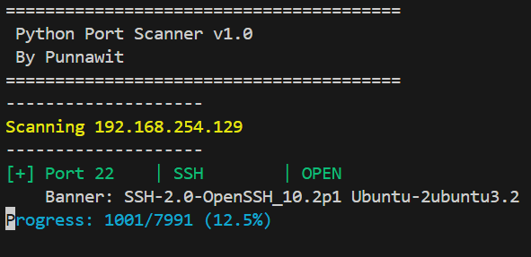
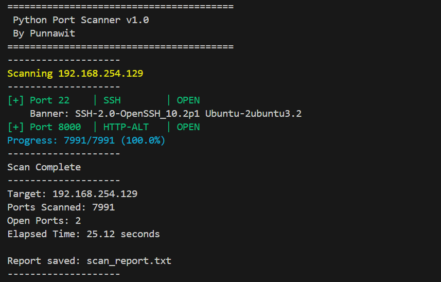
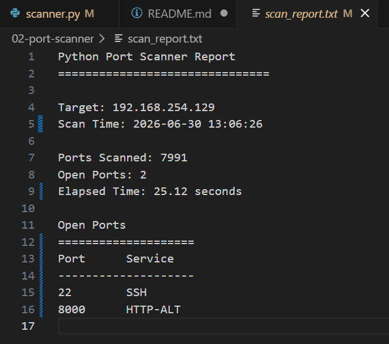

# Python Port Scanner


A multithreaded TCP Port Scanner written in Python for Cyber Security learning and portfolio.

---

## Project Overview

This project was developed to learn network programming, socket communication, multithreading, and basic service detection.

The scanner can:

- Scan TCP ports
- Detect common services
- Grab service banners
- Generate scan reports
- Display colored output
- Show real-time progress

---

## Features

- TCP Port Scanning
- Multi-threaded Scanning
- Banner Grabbing
- Service Detection
- CLI Arguments
- Scan Statistics
- Report Export (.txt)
- Colored Terminal Output
- Progress Indicator

---

## Technologies

- Python 3
- socket
- argparse
- concurrent.futures
- threading
- colorama

---

## Project Structure

```text
02-port-scanner/
│
├── scanner.py
├── README.md
├── scan_report.txt
└── screenshots/
    ├── scan_terminal_v1.0.png
    └── scan_report_v1.0.png
```

## Screenshots

### Scan Running



### Scan Result



### Report File



## Installation

Clone the repository

```bash
git clone https://github.com/Yimnastiz/cybersecurity-portfolio.git
```

Go to the project

```bash
cd cybersecurity-portfolio/02-port-scanner
```

Install dependency

```bash
pip install colorama
```

## Usage

Run

```bash
python scanner.py -t 192.168.254.129 -s 20 -e 100
```

Example

```text
========================================
Python Port Scanner v1.0
========================================

Scanning 192.168.254.129

[+] Port 22 | SSH | OPEN

Progress: 81/81 (100%)

Scan Complete
```

---

## Example Report

Target: 192.168.254.129
Scan Time: 2026-06-30 10:15:20

Ports Scanned: 81
Open Ports: 2
Elapsed Time: 0.42 sec

Open Ports
----------
22 - SSH
53 - DNS

---

# Development Timeline

### v0.1

- Basic TCP Scanner

### v0.2

- Better Code Structure

### v0.3

- Banner Detection

### v0.4

- Service Detection

### v0.5

- Command Line Arguments

### v0.6

- Multithreading

### v0.7

- Export Scan Report

### v0.8

- Scan Statistics

### v0.9

- Colored Output
- Progress Bar

### v1.0

- Code Refactoring
- main()
- Better Project Structure

---

## Skills Learned

- Python Networking
- TCP Socket Programming
- Multithreading
- Thread Synchronization
- Banner Grabbing
- CLI Development
- File Handling
- Performance Measurement
- Clean Code Structure

---


## Author

Punnawit

Cyber Security Student

GitHub:
https://github.com/Yimnastiz
